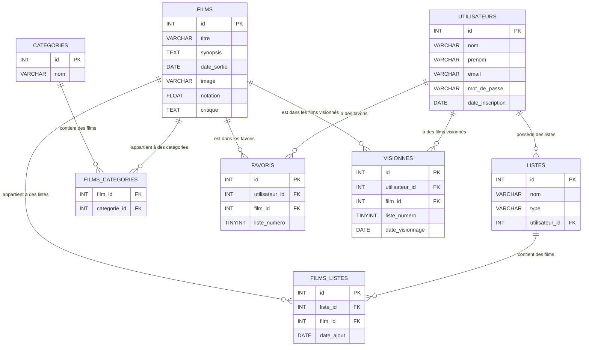

```mermaid
erDiagram
    UTILISATEURS {
        INT id PK
        VARCHAR nom
        VARCHAR prenom
        VARCHAR email
        VARCHAR mot_de_passe
        DATE date_inscription
    }

    CATEGORIES {
        INT id PK
        VARCHAR nom
    }

    FILMS {
        INT id PK
        VARCHAR titre
        TEXT synopsis
        DATE date_sortie
        VARCHAR image
        FLOAT notation
        TEXT critique
    }

    LISTES {
        INT id PK
        VARCHAR nom
        VARCHAR type
        INT utilisateur_id FK
    }

    FILMS_LISTES {
        INT id PK
        INT liste_id FK
        INT film_id FK
        DATE date_ajout
    }

    FILMS_CATEGORIES {
        INT film_id FK
        INT categorie_id FK
    }

    FAVORIS {
        INT id PK
        INT utilisateur_id FK
        INT film_id FK
        TINYINT liste_numero
    }

    VISIONNES {
        INT id PK
        INT utilisateur_id FK
        INT film_id FK
        TINYINT liste_numero
        DATE date_visionnage
    }

    UTILISATEURS ||--o{ LISTES : "possède des listes"
    LISTES ||--o{ FILMS_LISTES : "contient des films"
    FILMS ||--o{ FILMS_LISTES : "appartient à des listes"
    FILMS ||--o{ FILMS_CATEGORIES : "appartient à des catégories"
    CATEGORIES ||--o{ FILMS_CATEGORIES : "contient des films"
    UTILISATEURS ||--o{ FAVORIS : "a des favoris"
    FILMS ||--o{ FAVORIS : "est dans les favoris"
    UTILISATEURS ||--o{ VISIONNES : "a des films visionnés"
    FILMS ||--o{ VISIONNES : "est dans les films visionnés"
```
