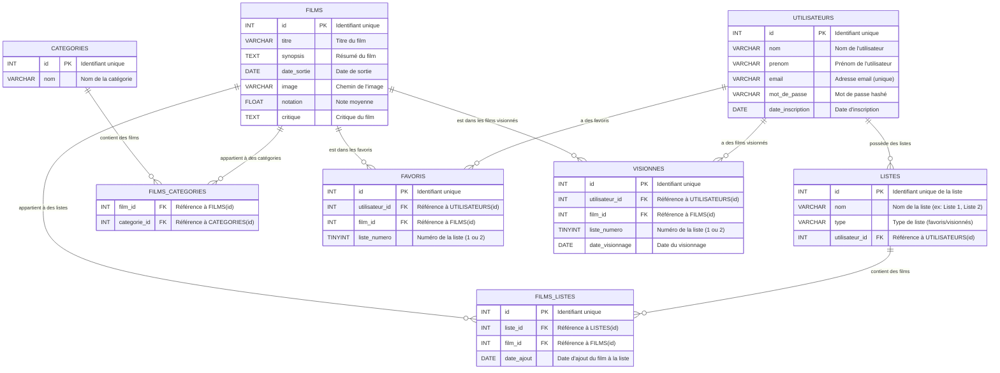

```mermaid
erDiagram
    UTILISATEURS {
        INT id PK "Identifiant unique"
        VARCHAR nom "Nom de l'utilisateur"
        VARCHAR prenom "Prénom de l'utilisateur"
        VARCHAR email "Adresse email (unique)"
        VARCHAR mot_de_passe "Mot de passe hashé"
        DATE date_inscription "Date d'inscription"
    }

    FILMS {
        INT id PK "Identifiant unique"
        VARCHAR titre "Titre du film"
        TEXT synopsis "Résumé du film"
        DATE date_sortie "Date de sortie"
        VARCHAR image "Chemin de l'image"
        FLOAT notation "Note moyenne"
        TEXT critique "Critique du film"
    }

    CATEGORIES {
        INT id PK "Identifiant unique"
        VARCHAR nom "Nom de la catégorie"
    }

    LISTES {
        INT id PK "Identifiant unique de la liste"
        VARCHAR nom "Nom de la liste (ex: Liste 1, Liste 2)"
        VARCHAR type "Type de liste (favoris/visionnés)"
        INT utilisateur_id FK "Référence à UTILISATEURS(id)"
    }

    FILMS_LISTES {
        INT id PK "Identifiant unique"
        INT liste_id FK "Référence à LISTES(id)"
        INT film_id FK "Référence à FILMS(id)"
        DATE date_ajout "Date d'ajout du film à la liste"
    }

    FILMS_CATEGORIES {
        INT film_id FK "Référence à FILMS(id)"
        INT categorie_id FK "Référence à CATEGORIES(id)"
    }

    FAVORIS {
        INT id PK "Identifiant unique"
        INT utilisateur_id FK "Référence à UTILISATEURS(id)"
        INT film_id FK "Référence à FILMS(id)"
        TINYINT liste_numero "Numéro de la liste (1 ou 2)"
    }

    VISIONNES {
        INT id PK "Identifiant unique"
        INT utilisateur_id FK "Référence à UTILISATEURS(id)"
        INT film_id FK "Référence à FILMS(id)"
        TINYINT liste_numero "Numéro de la liste (1 ou 2)"
        DATE date_visionnage "Date du visionnage"
    }

    UTILISATEURS ||--o{ LISTES : "possède des listes"
    LISTES ||--o{ FILMS_LISTES : "contient des films"
    FILMS ||--o{ FILMS_LISTES : "appartient à des listes"
    FILMS ||--o{ FILMS_CATEGORIES : "appartient à des catégories"
    CATEGORIES ||--o{ FILMS_CATEGORIES : "contient des films"
    UTILISATEURS ||--o{ FAVORIS : "a des favoris"
    FILMS ||--o{ FAVORIS : "est dans les favoris"
    UTILISATEURS ||--o{ VISIONNES : "a des films visionnés"
    FILMS ||--o{ VISIONNES : "est dans les films visionnés"
```
