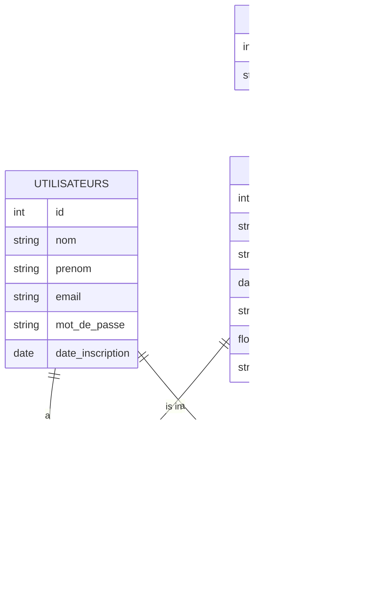

```mermaid
erDiagram
    UTILISATEURS {
        int id
        string nom
        string prenom
        string email
        string mot_de_passe
        date date_inscription
    }
    FILMS {
        int id
        string titre
        string synopsis
        date date_sortie
        string image
        float notation
        string critique
    }
    CATEGORIES {
        int id
        string nom
    }
    FAVORIS {
        int id
        int utilisateur_id
        int film_id
    }
    VISIONNES {
        int id
        int utilisateur_id
        int film_id
        date date_visionnage
    }

    UTILISATEURS ||--o{ FAVORIS : "a"
    UTILISATEURS ||--o{ VISIONNES : "a"
    FILMS ||--o{ FAVORIS : "is in"
    FILMS ||--o{ VISIONNES : "is in"
    CATEGORIES ||--o{ FILMS : "contains"
```
