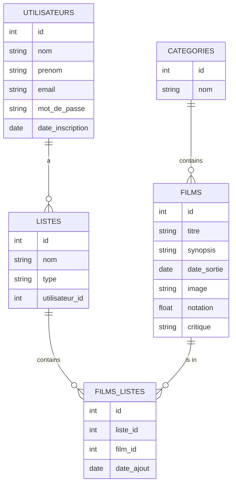

```mermaid
erDiagram
UTILISATEURS {
int id
string nom
string prenom
string email
string mot_de_passe
date date_inscription
}
FILMS {
int id
string titre
string synopsis
date date_sortie
string image
float notation
string critique
}
CATEGORIES {
int id
string nom
}
LISTES {
int id
string nom
string type
int utilisateur_id
}
FILMS_LISTES {
int id
int liste_id
int film_id
date date_ajout
}

    UTILISATEURS ||--o{ LISTES : "a"
    LISTES ||--o{ FILMS_LISTES : "contains"
    FILMS ||--o{ FILMS_LISTES : "is in"
    CATEGORIES ||--o{ FILMS : "contains"
```
