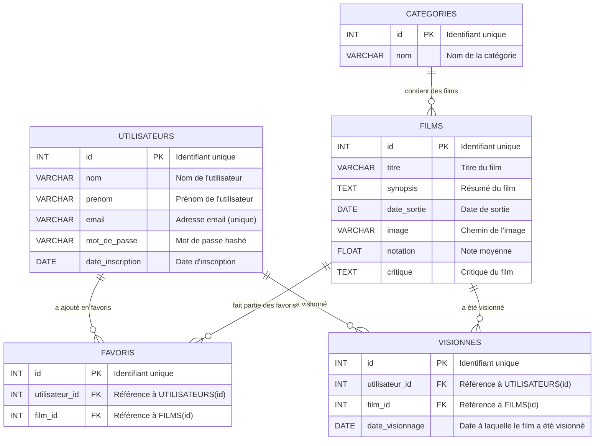

# Modèle Logique de Données (MLD)

```mermaid
erDiagram
    UTILISATEURS {
        INT id PK "Identifiant unique"
        VARCHAR nom "Nom de l'utilisateur"
        VARCHAR prenom "Prénom de l'utilisateur"
        VARCHAR email "Adresse email (unique)"
        VARCHAR mot_de_passe "Mot de passe hashé"
        DATE date_inscription "Date d'inscription"
    }

    FILMS {
        INT id PK "Identifiant unique"
        VARCHAR titre "Titre du film"
        TEXT synopsis "Résumé du film"
        DATE date_sortie "Date de sortie"
        VARCHAR image "Chemin de l'image"
        FLOAT notation "Note moyenne"
        TEXT critique "Critique du film"
    }

    CATEGORIES {
        INT id PK "Identifiant unique"
        VARCHAR nom "Nom de la catégorie"
    }

    FAVORIS {
        INT id PK "Identifiant unique"
        INT utilisateur_id FK "Référence à UTILISATEURS(id)"
        INT film_id FK "Référence à FILMS(id)"
    }

    VISIONNES {
        INT id PK "Identifiant unique"
        INT utilisateur_id FK "Référence à UTILISATEURS(id)"
        INT film_id FK "Référence à FILMS(id)"
        DATE date_visionnage "Date à laquelle le film a été visionné"
    }

    UTILISATEURS ||--o{ FAVORIS : "a ajouté en favoris"
    UTILISATEURS ||--o{ VISIONNES : "a visionné"
    FILMS ||--o{ FAVORIS : "fait partie des favoris"
    FILMS ||--o{ VISIONNES : "a été visionné"
    CATEGORIES ||--o{ FILMS : "contient des films"
```
