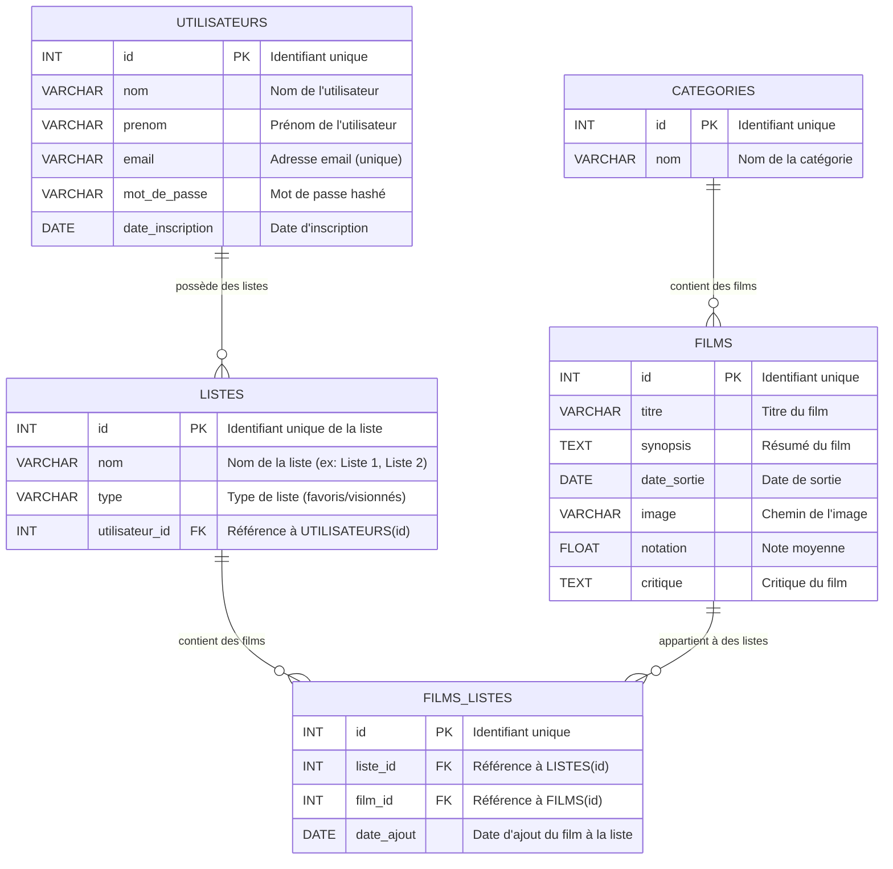

```mermaid
erDiagram
UTILISATEURS {
INT id PK "Identifiant unique"
VARCHAR nom "Nom de l'utilisateur"
VARCHAR prenom "Prénom de l'utilisateur"
VARCHAR email "Adresse email (unique)"
VARCHAR mot_de_passe "Mot de passe hashé"
DATE date_inscription "Date d'inscription"
}

    FILMS {
        INT id PK "Identifiant unique"
        VARCHAR titre "Titre du film"
        TEXT synopsis "Résumé du film"
        DATE date_sortie "Date de sortie"
        VARCHAR image "Chemin de l'image"
        FLOAT notation "Note moyenne"
        TEXT critique "Critique du film"
    }

    CATEGORIES {
        INT id PK "Identifiant unique"
        VARCHAR nom "Nom de la catégorie"
    }

    LISTES {
        INT id PK "Identifiant unique de la liste"
        VARCHAR nom "Nom de la liste (ex: Liste 1, Liste 2)"
        VARCHAR type "Type de liste (favoris/visionnés)"
        INT utilisateur_id FK "Référence à UTILISATEURS(id)"
    }

    FILMS_LISTES {
        INT id PK "Identifiant unique"
        INT liste_id FK "Référence à LISTES(id)"
        INT film_id FK "Référence à FILMS(id)"
        DATE date_ajout "Date d'ajout du film à la liste"
    }

    UTILISATEURS ||--o{ LISTES : "possède des listes"
    LISTES ||--o{ FILMS_LISTES : "contient des films"
    FILMS ||--o{ FILMS_LISTES : "appartient à des listes"
    CATEGORIES ||--o{ FILMS : "contient des films"
```