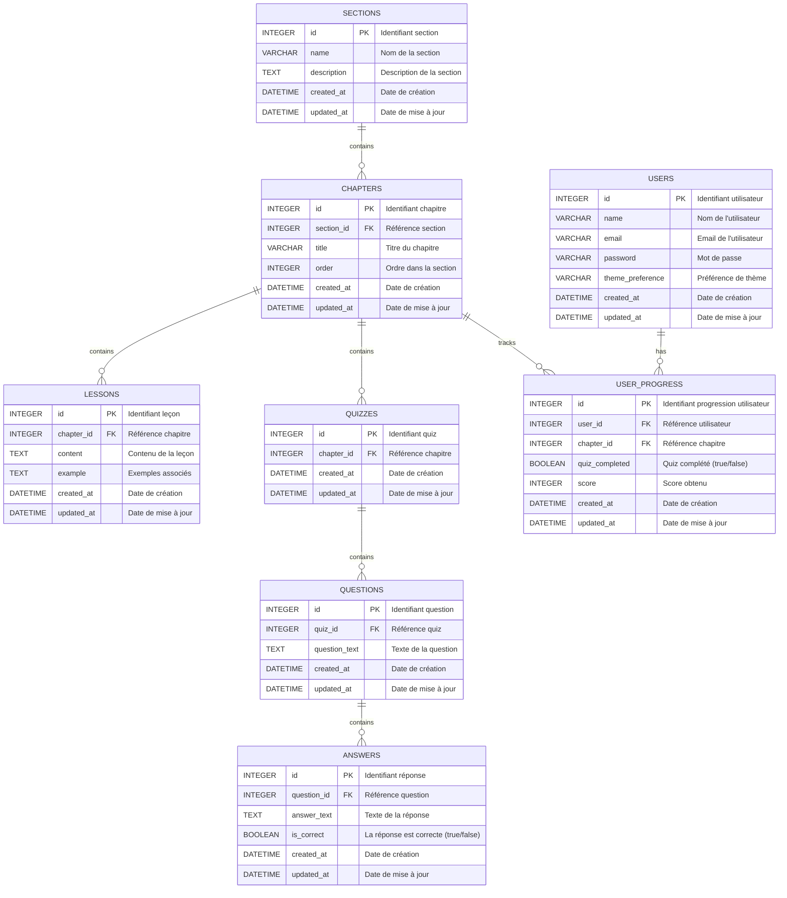

```mermaid
erDiagram
    USERS {
        INTEGER id PK "Identifiant utilisateur"
        VARCHAR name "Nom de l'utilisateur"
        VARCHAR email "Email de l'utilisateur"
        VARCHAR password "Mot de passe"
        VARCHAR theme_preference "Préférence de thème"
        DATETIME created_at "Date de création"
        DATETIME updated_at "Date de mise à jour"
    }

    SECTIONS {
        INTEGER id PK "Identifiant section"
        VARCHAR name "Nom de la section"
        TEXT description "Description de la section"
        DATETIME created_at "Date de création"
        DATETIME updated_at "Date de mise à jour"
    }

    CHAPTERS {
        INTEGER id PK "Identifiant chapitre"
        INTEGER section_id FK "Référence section"
        VARCHAR title "Titre du chapitre"
        INTEGER order "Ordre dans la section"
        DATETIME created_at "Date de création"
        DATETIME updated_at "Date de mise à jour"
    }

    LESSONS {
        INTEGER id PK "Identifiant leçon"
        INTEGER chapter_id FK "Référence chapitre"
        TEXT content "Contenu de la leçon"
        TEXT example "Exemples associés"
        DATETIME created_at "Date de création"
        DATETIME updated_at "Date de mise à jour"
    }

    QUIZZES {
        INTEGER id PK "Identifiant quiz"
        INTEGER chapter_id FK "Référence chapitre"
        DATETIME created_at "Date de création"
        DATETIME updated_at "Date de mise à jour"
    }

    QUESTIONS {
        INTEGER id PK "Identifiant question"
        INTEGER quiz_id FK "Référence quiz"
        TEXT question_text "Texte de la question"
        DATETIME created_at "Date de création"
        DATETIME updated_at "Date de mise à jour"
    }

    ANSWERS {
        INTEGER id PK "Identifiant réponse"
        INTEGER question_id FK "Référence question"
        TEXT answer_text "Texte de la réponse"
        BOOLEAN is_correct "La réponse est correcte (true/false)"
        DATETIME created_at "Date de création"
        DATETIME updated_at "Date de mise à jour"
    }

    USER_PROGRESS {
        INTEGER id PK "Identifiant progression utilisateur"
        INTEGER user_id FK "Référence utilisateur"
        INTEGER chapter_id FK "Référence chapitre"
        BOOLEAN quiz_completed "Quiz complété (true/false)"
        INTEGER score "Score obtenu"
        DATETIME created_at "Date de création"
        DATETIME updated_at "Date de mise à jour"
    }

    %% Définition des relations
    USERS ||--o{ USER_PROGRESS : "has"
    SECTIONS ||--o{ CHAPTERS : "contains"
    CHAPTERS ||--o{ LESSONS : "contains"
    CHAPTERS ||--o{ QUIZZES : "contains"
    QUIZZES ||--o{ QUESTIONS : "contains"
    QUESTIONS ||--o{ ANSWERS : "contains"
    CHAPTERS ||--o{ USER_PROGRESS : "tracks"

```
